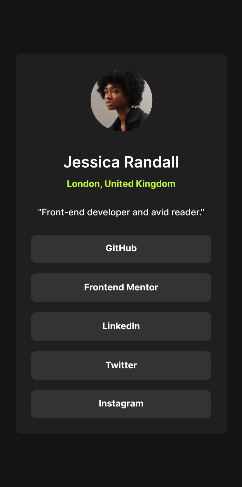
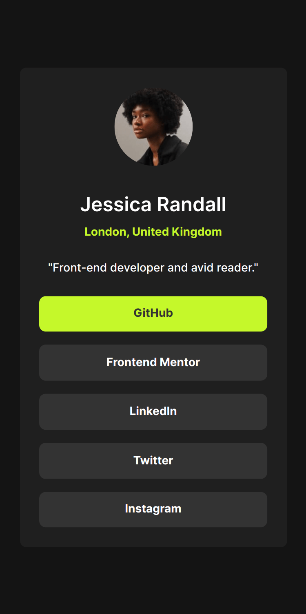
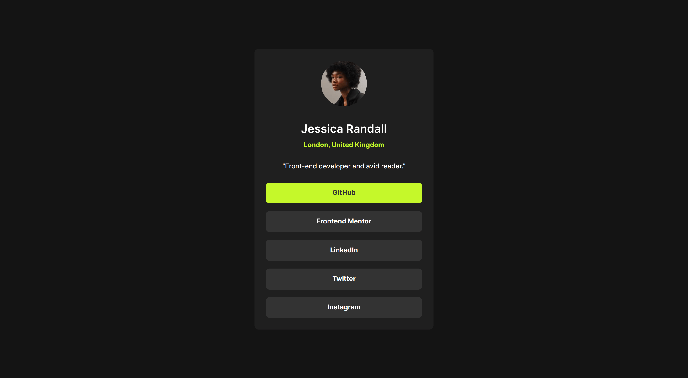

# Frontend Mentor - Social links profile solution

This is a solution to the [Social links profile challenge on Frontend Mentor](https://www.frontendmentor.io/challenges/social-links-profile-UG32l9m6dQ). Frontend Mentor challenges help you improve your coding skills by building realistic projects. 

## Table of contents

- [Overview](#overview)
  - [The challenge](#the-challenge)
  - [Screenshot](#screenshot)
  - [Links](#links)
- [My process](#my-process)
  - [Built with](#built-with)
  - [What I learned](#what-i-learned)
- [Author](#author)

## Overview

### Screenshot






### Links

- Solution URL: [Add solution URL here](https://your-solution-url.com)
- Live Site URL: [Add live site URL here](https://your-live-site-url.com)

## My process

### Built with

- Semantic HTML5 markup
- CSS custom properties
- Flexbox
- Mobile-first workflow
- [React](https://reactjs.org/) - JS library
- [Tailwind css](https://tailwindcss.com/) - Tailwind css

### What I learned

This project allowed me to learn Tailwind CSS and React JS in a simple way and then continue advancing on larger and more difficult projects.

Below I show how the components look with tailwind css

```js
const CardUser = () => {
  return (
    <div className="bg-dark-gray-custom rounded-lg px-6 mx-6 py-6 w-full max-w-[375px] flex flex-col items-center">
      
      <div className='py-4 text-white-custom my-2 flex flex-col items-center gap-2'>
        <h1 className='text-2xl text-while-custom font-semibold'>Jessica Randall</h1>
        <p className='text-green-custom font-bold'>London, United Kingdom</p>
      </div>
      <p className='text-white-custom font-medium'>"Front-end developer and avid reader."</p>
      <div className='mt-6 flex flex-col items-center w-full gap-4'>
        {
          linksData.map(item =>
            <CardLinkItem
              key={item.link}
              link={item.link}
            />
          )
        }
      </div>
    </div >
  )
}
```

## Author

- Frontend Mentor - [@jrag-dev](https://www.frontendmentor.io/profile/jrag-dev)
- LinkedIn - [@yourusername](https://www.linkedin.com/in/jrag-dev/)